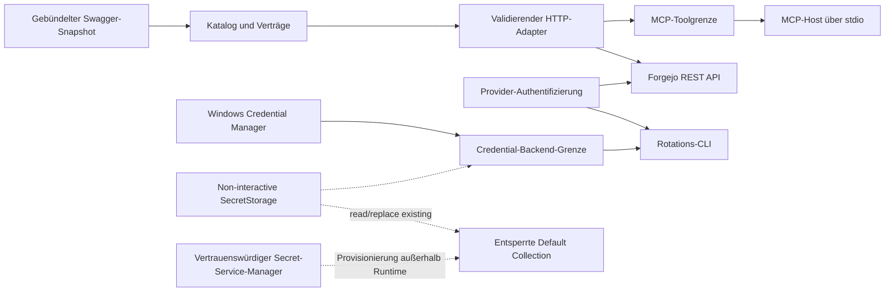

# Architektur

## Zweck und Systemgrenze

Forgejo API MCP ist ein lokaler Python-MCP-Server. Er übersetzt MCP-Aufrufe in
validierte Forgejo-REST-Aufrufe auf Basis eines geprüften, mit dem Paket
ausgelieferten Swagger-2.0-Snapshots. Der Prozess spricht ausschließlich MCP über
`stdio`; Forgejo ist der einzige reguläre Netzwerkpartner.

## Domänenkarte

| Domäne | Verantwortung | Grenze |
|---|---|---|
| API-Vertrag | Swagger laden, Referenzen auflösen, Operationen normalisieren und suchen | Kein Netzwerkzugriff, unveränderlicher Laufzeitkatalog |
| Forgejo-Adapter | Eingaben validieren, Requests serialisieren, Grenzen erzwingen, Antworten redigieren | Einziger allgemeiner Forgejo-HTTP-Pfad |
| MCP-Grenze | Vier stabile Tools registrieren und den lokalen `stdio`-Transport starten | Keine Geschäftslogik und kein HTTP-Listener |
| Provider-Authentifizierung | Token mit einer statusbasierten, inhaltslosen Anfrage klassifizieren | Keine Persistenz und keine Antwortkörperauswertung |
| Credential-Rotation | Credential lesen/schreiben, Rotation serialisieren und Rollback verifizieren | Getrennte Windows- und Linux-Adapter hinter derselben internen Grenze |
| Paket und Verifikation | Snapshot ausliefern, Installation sowie Vertrag und Sicherheitsregeln testen | Build über Hatchling, Ausführung und Tests über `uv` |

## Schichtung und Abhängigkeiten

The central `select_credential_backend` selector is the only platform decision point. It selects
the Windows Credential Manager adapter on `win32` or the Linux SecretStorage adapter on `linux`;
unsupported platforms fail closed. Both adapters implement the same narrow backend contract, so
the rotation transaction remains shared and platform-neutral. The package-owned
`forgejo-api-mcp-launch` launcher uses that selector once, reads the credential once, and injects
it only into the MCP child process.

Die erlaubte Richtung ist grundsätzlich von der äußeren Laufzeitgrenze zu
inneren Verträgen: `server → client → catalog`. `provider_auth` ist ein enger,
wiederverwendeter Probeadapter. `rotate` orchestriert `provider_auth` und
`credentials`; der normale MCP-Server greift nie direkt auf den Credential Store
zu.

## Hauptdatenfluss

1. Beim Import des Servers wird der Swagger-Snapshot aus dem installierten Paket
   geladen und zu einem unveränderlichen Operationskatalog normalisiert.
2. Basis-URL und Token werden einmal aus der Kindprozessumgebung erfasst.
3. Der Client entdeckt mit `list_operations` und `get_operation` den Vertrag.
4. `invoke_operation` trennt Parametergruppen, validiert sie gegen den Vertrag
   und serialisiert genau einen begrenzten HTTP-Aufruf.
5. Der Adapter liefert JSON/Text begrenzt und redigiert oder Binärdaten als
   begrenztes Base64 zurück; Fehler bleiben strukturiert und geheimnisfrei.

Schreibende und destruktive Operationen werden im Katalog markiert, aber nicht
serverseitig angehalten. Die explizite Bestätigung des Benutzers ist daher eine
verbindliche Verantwortung des aufrufenden MCP-Clients oder Agenten.

## Credential-Datenfluss

Der gemeinsame Credential-Pfad arbeitet mit beiden Plattformadaptern wie folgt:

1. Der package-owned Launcher liest das feste Plattform-Credential und injiziert es nur in die
   Umgebung des MCP-Kindprozesses.
2. Die Rotations-CLI liest einen Kandidaten ausschließlich von stdin und prüft
   ihn vor jeder Speicherung über HTTPS.
3. Innerhalb eines benutzerbezogenen, begrenzten Mutex wird der vorherige
   Datensatz erfasst, der Kandidat geschrieben und per gewöhnlichem exaktem lokalem
   Gleichheitsvergleich rückgelesen; es gibt keinen angreiferbeobachtbaren Vergleichsorakel.
4. Bei Abweichung oder Readback-Fehler wird der vorherige Zustand wiederhergestellt
   oder der neue Datensatz gelöscht; das Ergebnis bleibt redigiert.
5. Vor jeder Linux-Mutation wird unter dem verankerten POSIX-Lock ein dauerhafter
   nicht-geheimer Fence gesetzt. Ein bestätigtes Ergebnis entfernt den provisorischen Fence;
   ein Timeout nach Dispatch lässt ihn bestehen. Diagnose-Reads und Restore ändern den
   öffentlichen Zustand `unknown` nicht, weil D-Bus-Cancellation nicht beweisbar ist.
6. Eine erfolgreiche Rotation erfordert einen Serverneustart, weil der laufende
   Prozess seinen Start-Snapshot behält.

### Implementierte Linux-Credentials

Der Linux-Adapter bindet Secret Service direkt über
`SecretStorage>=3.5,<4; sys_platform == 'linux'` an. Ein externer
Credential-Subprozess, ein solcher Fallback und eine eigene rohe D-Bus-
Implementierung sind ausgeschlossen. Jeepney und cryptography bleiben transitive
Bibliotheksabhängigkeiten; zur Laufzeit sind eine D-Bus-Session des Benutzers und
ein laufender Secret-Service-Daemon erforderlich.

Launcher und Rotation sind strikt non-interactive. Der Adapter löst ausschließlich
eine bereits vorhandene Default Collection über
`get_collection_by_alias(connection, "default")` oder eine gleichwertige,
nicht-erzeugende API auf. Die Collection muss entsperrt sein und genau ein
vorprovisioniertes Item mit der festen Identität
(`application=forgejo-api-mcp`, `credential-kind=access-token`,
`target=mcp/forgejo-mcp/access-token`) enthalten. Initiale Provisionierung und
Entsperrung erfolgen außerhalb dieses Pfads mit einem vertrauenswürdigen Secret-
Service-Manager; es gibt keinen externen Credential-Command-Fallback.

Runtime und Rotation rufen weder `unlock()` oder Prompts noch
`create_collection`, `create_item`, `Item.delete` oder `Collection.delete` auf.
Missing, Locked und Prompt-required stoppen fail-closed mit einer redigierten
Setup-Anweisung. `PromptDismissedException` wird trotz des erwartbar
promptfreien Pfads vor seiner Basisklasse `ItemNotFoundException` abgefangen und
als `prompt_dismissed` gemappt.

Der Backendvertrag umfasst nur `availability`, `read`, `snapshot`,
`replace_existing`, `restore`, `discard` und einen begrenzten per-user Lock; es
gibt kein generisches Create/Delete. Rotation validiert den Kandidaten vor dem
Lock. Danach hält sie einen Kernel-`flock`/OS-Handle über
`snapshot -> replace_existing -> readback -> rollback oder commit cleanup -> discard`
und gibt ihn auf jedem normalen und Exception-Pfad frei. Bei Prozess-Hard-Abort
schließt der Kernel den Deskriptor/Handle und löst den Lock, auch wenn sprachliche
Cleanup-Pfade nicht mehr laufen.

Der konkrete Linux-Adapter besitzt zusätzlich eine ausschließlich lokale administrative
Fence-Grenze. Launcher und zukünftige Rotation prüfen sie unter demselben Lock vor Secret-Service-
Zugriff. Nur `forgejo-api-mcp-quarantine clear --operator-verified` entfernt den Marker nach einer
externen Prüfung im vertrauenswürdigen Manager; die Administration liest oder schreibt kein Secret.

Der opake Snapshot wird auf Commit, Rollback und Fehler explizit verworfen.
`discard` nullt mutable Buffer best-effort und entfernt Referenzen, garantiert
aber keine Löschung bereits erzeugter immutable `bytes` oder ihrer Kopien.
Secrets gelangen nie in öffentliche Ausgabe, Logs, Fehler, Tests oder
Konfiguration. Die vollständige Entscheidung steht in
[docs/credential-launch.md](docs/credential-launch.md) und
[docs/credential-rotation.md](docs/credential-rotation.md).

## Infrastruktur und Plattformen

- Laufzeit: lokaler Python-Prozess, MCP über `stdio`, kein eingehender Port.
- Ausgehend: HTTPS zu einer konfigurierten Forgejo-Instanz; Redirects und
  Umgebungs-Proxys sind deaktiviert.
- Secrets: Kindprozessumgebung zur Laufzeit; Windows Credential Manager oder Linux
  Secret Service für persistente lokale Speicherung.
- Plattformstatus: Der API-Server ist plattformneutral; Speichern, Launcher und
  Rotation wählen explizit den Windows- oder Linux-Adapter und fail-closed auf anderen Plattformen.

## Änderungsgrenzen

- Änderungen am Swagger-Snapshot folgen dem geprüften Verfahren in
  [docs/maintenance.md](docs/maintenance.md).
- Sicherheits- und Secret-Regeln stehen in [docs/SECURITY.md](docs/SECURITY.md).
- Laufzeitgrenzen und Fehlerverhalten stehen in
  [docs/RELIABILITY.md](docs/RELIABILITY.md).
- Die getrennten Plattformadapter dürfen die plattformneutrale Server-, Launcher- und
  Rotationsschicht nicht duplizieren.
